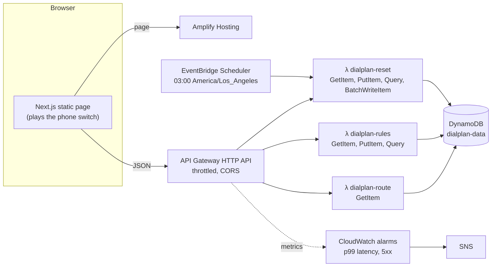

# dialplan

A call-routing decision service on AWS. When a call arrives, the phone switch
asks the API _where should this ring?_ and the answer comes from the
business's dialplan: VIP callers, then holidays, then opening hours, then
after hours. There are no real calls or audio; the web page plays the switch.

- **Live demo:** https://main.d1hlrlhjv9b5my.amplifyapp.com
- **API:** https://ax1lwqgkui.execute-api.us-west-2.amazonaws.com

The demo tenant is **Harbor Auto**, a fictional car dealership in San Diego
with a main line and a service department. Every phone number is in the
555-0100 to 555-0199 range reserved for fiction. The data resets every night
at 03:00 San Diego time, or on demand from the page.

## Architecture



Everything is Terraform. Lambdas are Node.js 24 on arm64, bundled with
esbuild. The web app is a Next.js static export (no API routes) on an Amplify
app with no Git connection; CI uploads each build through Amplify's
deployment API.

| Path              | What                                                                 |
| ----------------- | -------------------------------------------------------------------- |
| `shared/`         | zod schemas: the contract between the API and the web app            |
| `api/`            | Lambda handlers, the rule engine, the DynamoDB store, seed data      |
| `web/`            | The one-page demo (Next.js, Tailwind, Luxon, d3-geo)                 |
| `infra/`          | Terraform for the app: table, functions, API, Amplify, schedule, alarms |
| `infra/bootstrap` | One-time setup: state bucket, GitHub OIDC provider, CI roles         |
| `scripts/`        | `deploy-web.sh` (used by CI) and `push-function.sh` (fast iteration) |

## The API

| Route                                   | What                                                                  |
| --------------------------------------- | --------------------------------------------------------------------- |
| `POST /v1/route`                        | `{did, caller, timestamp}` → destination, matched rule, local time, server ms. `?explain=true` adds the step-by-step trace. |
| `GET /v1/numbers/{did}/rules`           | The dialplan for a number, with its `version`.                        |
| `PUT /v1/numbers/{did}/rules`           | `{version, rules}`. Validated with zod; `409` if `version` is stale. Writes an audit entry in the same transaction. |
| `GET /v1/numbers/{did}/audit`           | What changed, newest first.                                           |
| `GET /v1/tenants/{tenantId}/numbers`    | A tenant's numbers (feeds the number switcher).                       |
| `POST /v1/demo/reset`                   | Restore the demo data.                                                |
| `GET /v1/health`                        | Used by the deploy smoke test.                                        |

```sh
curl -s -X POST 'https://ax1lwqgkui.execute-api.us-west-2.amazonaws.com/v1/route?explain=true' \
  -H 'content-type: application/json' \
  -d '{"did":"+16195550100","caller":"+12125550123","timestamp":"2026-11-24T19:00:00-08:00"}'
```

```json
{
  "did": "+16195550100",
  "caller": "+12125550123",
  "decision": { "kind": "external", "target": "+16195550199", "label": "Answering service" },
  "matchedRule": "afterHours",
  "localTime": "2026-11-24T19:00:00.000-08:00",
  "timezone": "America/Los_Angeles",
  "dialplanVersion": 8,
  "serverMs": 6.77,
  "timings": { "dbMs": 5.97, "engineMs": 0.74 },
  "coldStart": false,
  "trace": [
    { "stage": "clock", "result": "info", "detail": "2026-11-24T19:00:00-08:00 is Tue 24 Nov 2026, 19:00:00 PST (UTC-08:00) in America/Los_Angeles" },
    { "stage": "vip", "result": "no_match", "detail": "+12125550123 is not among 2 VIP callers" },
    { "stage": "holidays", "result": "no_match", "detail": "2026-11-24 is not a holiday" },
    { "stage": "hours", "result": "no_match", "detail": "19:00 is outside Tuesday hours (08:00–18:00)" },
    { "stage": "afterHours", "result": "matched", "detail": "No earlier rule matched → Answering service" }
  ]
}
```

A warm call spends 6–9 ms in the handler, almost all of it the DynamoDB
read; the rule engine takes under a millisecond. The response also carries a
`Server-Timing` header with the same breakdown.

Errors are JSON with a stable `error` code (`invalid_request` with per-field
`issues`, `unknown_number`, `version_conflict` with `currentVersion`, …).

## The rule engine

[`decide(rules, timezone, call)`](api/src/engine/decide.ts) is a pure
function. Rules run in a fixed order and the first match wins; after hours
always matches. Holidays and opening hours are wall-clock rules in the
business's time zone, so the call's instant is converted with Luxon before
anything is compared. Opening intervals are `[open, close)`.

[The tests](api/src/engine/decide.test.ts) pin down the cases that break
naive implementations, using America/Los_Angeles in 2026:

- **Spring forward (8 March):** 01:59:59 PST is followed by 03:00:00 PDT. An
  interval inside the skipped hour never opens; one spanning the gap is open
  on both sides of it.
- **Fall back (1 November):** 01:30 happens twice, in PDT and then PST, and
  both get the same answer.
- **Opening at 08:00 local** is 16:00Z in winter and 15:00Z in summer; the
  tests check both sides of each change.
- **Holidays use the local date:** 23:59 on Thanksgiving is Thanksgiving, even
  though UTC already says the 27th.

## Data model

One table, `dialplan-data`, on-demand, with point-in-time recovery and
deletion protection.

| Item      | `pk`           | `sk`             | Also                                          |
| --------- | -------------- | ---------------- | --------------------------------------------- |
| Dialplan  | `DID#<number>` | `RULES`          | `version`, `rules`, `gsi1pk = TENANT#<id>`, `gsi1sk = DID#<number>` |
| Audit     | `DID#<number>` | `AUDIT#<iso>`    | `changes`, a snapshot of the rules, `expiresAt` (30-day TTL) |

| Access pattern           | Operation                                                         |
| ------------------------ | ----------------------------------------------------------------- |
| Route a call             | `GetItem` `DID#<n>` / `RULES`, strongly consistent                |
| Read a dialplan          | `GetItem` `DID#<n>` / `RULES`                                     |
| Save a dialplan          | `TransactWriteItems`: put `RULES` if `version = :expected`, put `AUDIT#<now>` if absent |
| Audit log, newest first  | `Query` `DID#<n>`, `begins_with(sk, "AUDIT#")`, descending        |
| A tenant's numbers       | `Query` on `gsi1`, `gsi1pk = TENANT#<id>`. Sparse: only `RULES` items carry the key |

## Infrastructure and security

- **Least privilege, by hand.** Each function has its own role with exactly the
  DynamoDB actions its code calls; the route function can only `GetItem`.
  Roles are created under `/dialplan/workload/` with a permissions boundary,
  and the CI deploy role may only create roles that carry that boundary, so
  it cannot mint anything more powerful than the app needs.
- **No access keys.** GitHub Actions assumes roles through OIDC. The trust
  policies use GitHub's immutable subject
  (`repo:shshwtsuthar@74776092/dialplan@1397020900:…`), which embeds the
  owner and repository IDs, so a recreated repo with the same name gets
  nothing. Pull requests get a read-only **plan** role; only the `production`
  environment, restricted to `main`, can assume the **deploy** role.
- **State** lives in a versioned, encrypted, private S3 bucket created by
  `infra/bootstrap`, with S3-native locking (`use_lockfile`) instead of a
  DynamoDB lock table. The plan role can take the lock but not write state.
- **Throttling:** 50 rps (burst 100) per stage, tighter on `PUT` rules (5/10)
  and reset (1/2).
- **Alarms:** API p99 latency above 1 s, and any 5xx, notify an SNS topic
  (set `alarm_email` to subscribe).

## CI/CD

[`.github/workflows/ci.yml`](.github/workflows/ci.yml):

- **Every change:** typecheck, lint, test.
- **Pull requests:** build the Lambda bundles, then `terraform fmt -check`,
  `validate` and `plan` with the read-only role. The plan is posted as a
  single PR comment that updates on each push.
- **`main`:** plan and apply with the deploy role, build the web app with
  the API URL and the commit/run for the footer, deploy it to Amplify, and
  smoke-test both.

Lambda zips are byte-for-byte reproducible (fixed timestamps, no absolute
paths), so a function only redeploys when its bundle actually changes.
Terraform compares each bundle's hash with the code Lambda is actually running
(`code_sha256`), so code changed outside Terraform shows up in the next plan
and the next apply puts `main`'s build back.

## Working on it

```sh
npm ci
npm test                      # 129 tests: engine, handlers, web helpers
npm run typecheck && npm run lint

# Web app against the deployed API
NEXT_PUBLIC_API_URL=https://ax1lwqgkui.execute-api.us-west-2.amazonaws.com npm run dev -w @dialplan/web

# Terraform (reads your AWS_PROFILE)
npm run build:api && cd infra && AWS_PROFILE=dialplan terraform plan

# Fast iteration: rebuild one function and push its code directly
scripts/push-function.sh route
```

`push-function.sh` skips Terraform and CI for a quick test against the real
table. It changes code only; the next plan shows the difference, and the next
deploy from `main` replaces it.

### Bootstrap (once, from a laptop)

```sh
cd infra/bootstrap
AWS_PROFILE=dialplan terraform init && AWS_PROFILE=dialplan terraform apply
```

Put the `state_bucket` output in `infra/versions.tf`, then set the GitHub
variables `AWS_PLAN_ROLE_ARN` (repository) and `AWS_DEPLOY_ROLE_ARN` (on the
`production` environment, restricted to `main`). The bootstrap state stays
local on purpose.

## Design decisions

- **A fixed rule order rather than a generic rule list.** It matches how
  businesses think about their phones and keeps editing simple. The engine
  is one function with one loop, so moving to an ordered list of typed rules
  later is a contained change.
- **Strongly consistent reads on the routing path.** An edit applies to the
  very next call, which the demo relies on. It costs one extra read unit per
  lookup.
- **Optimistic concurrency.** The client sends the version it edited. The
  handler rejects a stale version before writing, and the transaction's
  condition catches the race after that check. The rules write and its
  audit entry succeed or fail together.
- **Validation in one place.** The zod schemas in `shared/` validate the
  API's input, the editor's form and the API's responses in the browser.
- **Versions keep increasing across resets,** so someone editing a
  pre-reset copy gets a conflict instead of silently overwriting.
- **Seeding is part of the deploy.** An `aws_lambda_invocation` runs the
  reset function when the table is created or the seed data changes. It
  waits for the function's IAM policy to propagate first: the first deploy
  showed DynamoDB denying a correctly permitted role for about two minutes.
- **No custom response headers on Amplify yet.** The Terraform provider
  reports a change on every plan for them
  ([#34318](https://github.com/hashicorp/terraform-provider-aws/issues/34318)).
  Noisy plans hide real changes, so they are left for CloudFront (below).

## What I'd change for production

- **Authentication and tenancy.** Put a JWT authorizer on everything except
  `/v1/route` (which would sit behind the switch's private network or mTLS),
  and scope each tenant's access with `dynamodb:LeadingKeys` on
  `DID#` partitions they own.
- **Latency and availability on the routing path.** Open the DynamoDB
  connection during the Lambda init phase (the first read on a new container
  pays for the TLS handshake), and cache dialplans in the function with a
  short TTL and a version check. Use provisioned concurrency to remove cold
  starts, and DynamoDB global tables with a regional API in each region.
  Also raise this account's Lambda concurrency quota, which is at the
  new-account default of 10.
- **Environments.** Add a staging stack with its own state, and apply the
  exact plan artifact reviewed in the PR rather than re-planning on `main`.
- **Edge.** A custom domain behind CloudFront, with a response headers policy
  for HSTS and a CSP, plus WAF rate rules.
- **Observability.** Traces (X-Ray or OpenTelemetry), a dashboard,
  SLO-based alarms routed to on-call rather than raw thresholds, and export of
  the audit log to S3 before its TTL expires.
- **Tests.** Integration tests for the DynamoDB store against DynamoDB Local,
  and end-to-end tests of the page with Playwright in CI.
- **Rules.** Holiday calendars shared across a tenant's numbers, recurring
  holidays ("fourth Thursday in November"), and overnight intervals that
  cross midnight.
